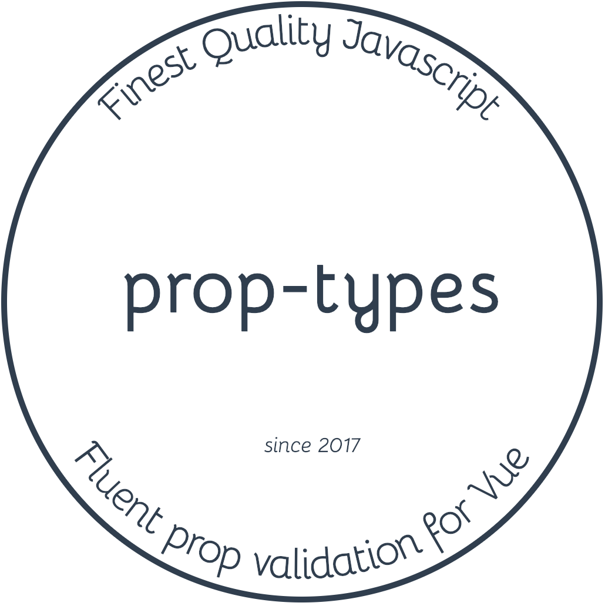

<div class="text-xs-center" align="center" style="margin: 20px">
  
</div><br><br>

<div class="text-xs-center" align="center">

  [](https://vuejs.org/)
  [](https://npmjs.com/package/@znck/prop-types)
  [](https://npmjs.com/package/@znck/prop-types)
  [](https://circleci.com/gh/znck/prop-types/tree/master)
  [](https://codecov.io/gh/znck/prop-types)

</div>

## Introduction

Fluent prop validation for Vue that won't land in your production code.

> Use [rollup-plugin-replace](https://github.com/rollup/rollup-plugin-replace) or [DefinePlugin](https://webpack.js.org/plugins/define-plugin/) to replace `process.env.NODE_ENV`  with `'production'`.  
> If you are using Vue CLI or Nuxt, it's already done for you.

## Usage

### Installation

```shell
npm install --save @znck/prop-types
```

### Examples

```js
import PropTypes from '@znck/prop-types'; // ES6
var PropTypes = require('@znck/prop-types'); // ES5 with npm
```

Make sure to add `@znck/prop-types/remove` to babel config.

```js
// babel.config.js or .babelrc.js
...
  plugins: [
    '@znck/prop-types/remove'
  ]
...
```

Here is an example of using PropTypes with a Vue component, which also
documents the different validators provided:

<!-- Example borrowed from facebook/prop-types -->

```vue
<script>
import PropTypes from 'prop-types';

export default {
  props: {
    // You can declare that a prop is a specific JS primitive. By default, these
    // are all optional.
    optionalArray: PropTypes.array,
    optionalBool: PropTypes.bool,
    optionalFunc: PropTypes.func,
    optionalNumber: PropTypes.number,
    optionalObject: PropTypes.object,
    optionalString: PropTypes.string,
    optionalSymbol: PropTypes.symbol,

    // You can also declare that a prop is an instance of a class. This uses
    // JS's instanceof operator.
    optionalMessage: PropTypes.instanceOf(Message),

    // You can ensure that your prop is limited to specific values by treating
    // it as an enum.
    optionalEnum: PropTypes.oneOf(['News', 'Photos']),

    // An object that could be one of many types
    optionalUnion: PropTypes.oneOfType([
      PropTypes.string,
      PropTypes.number,
      PropTypes.instanceOf(Message)
    ]),

    // An array of a certain type
    optionalArrayOf: PropTypes.arrayOf(PropTypes.number),

    // An object with property values of a certain type
    optionalObjectOf: PropTypes.objectOf(PropTypes.number),

    // An object taking on a particular shape
    optionalObjectWithShape: PropTypes.shape({
      color: PropTypes.string,
      fontSize: PropTypes.number
    }),

    // You can chain any of the above with `isRequired` to make sure a warning
    // is shown if the prop isn't provided.
    requiredFunc: PropTypes.func.isRequired,

    // A value of any data type
    requiredAny: PropTypes.any.isRequired,

    // You can also supply a custom validator.
    customArrayProp: PropTypes.string.validate(value => value === 'foo'),
  }
}
</script>
```

## Contributing

Please read [CONTRIBUTING.md](CONTRIBUTING.md) for details on our code of conduct, and the process for submitting pull requests to us.

## Versioning

We use [SemVer](http://semver.org/) for versioning. For the versions available, see the [tags on this repository](https://github.com/znck/prop-types/releases).

## Author

**prop-types** © [Rahul Kadyan](https://github.com/znck), Released under the [MIT](./LICENSE) License.<br>
Authored and maintained by Rahul Kadyan with help from contributors ([list](https://github.com/znck/prop-types-temp/contributors)).

> [znck.me](https://znck.me) · GitHub [@Rahul Kadyan](https://github.com/znck) · Twitter [@znck0](https://twitter.com/@znck0)
